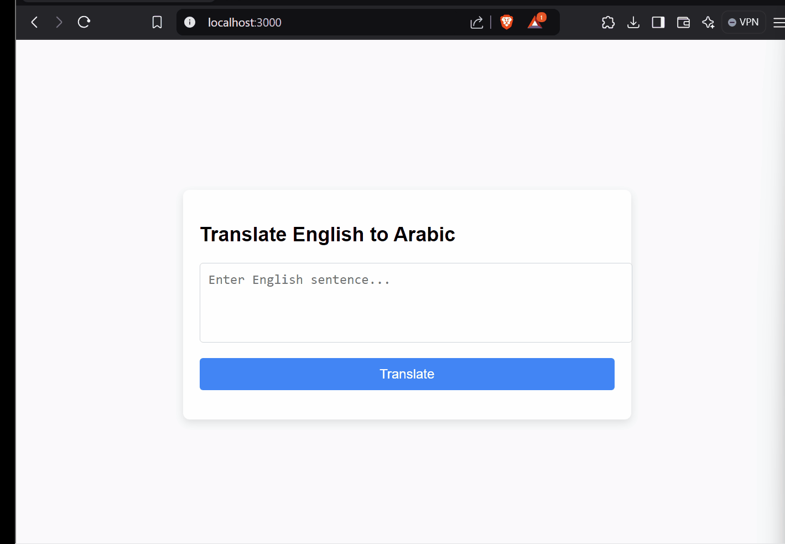

# English-to-Arabic Translator using a Transformer Model

## Table of Contents
1. [Overview](#overview)
2. [Features](#features)
3. [Technologies Used](#technologies-used)
4. [Setup and Installation](#setup-and-installation)
5. [Usage](#usage)
6. [Dockerization](#dockerization)
7. [Deployment](#deployment)
8. [Acknowledgments](#acknowledgments)

## 1. Overview
This project is an **English-to-Arabic Neural Machine Translation (NMT)** system built using a **Transformer model**. It allows users to input English sentences and receive translations in Arabic. The system is composed of two parts: a backend server using **Flask** and **TensorFlow**, and a frontend served using **Python's HTTP Server**. The model is trained using a **Transformer architecture** and performs real-time translations.



## 2. Features
- **Real-time Translation**: Translates English to Arabic.
- **Pretrained Transformer Model**: Incorporates a state-of-the-art transformer model for language translation.
- **Dockerized Setup**: Backend and frontend are Dockerized for easy setup and deployment.
- **Masked Accuracy Metrics**: Custom loss and accuracy metrics for handling padded sequences.
- **Scalable Deployment**: Can be deployed to services like Render or any Docker-compatible platform.

## 3. Technologies Used
- **Backend**: Flask, TensorFlow, Gunicorn
- **Frontend**: HTML5, CSS, JavaScript, Python HTTP Server
- **Model**: Transformer Architecture for NMT
- **Containerization**: Docker, Docker Compose
- **Deployment**: Render (or another service)

## 4. Setup and Installation

### Prerequisites
- Install [Docker](https://docs.docker.com/get-docker/)
- Basic understanding of Docker Compose

### Installation Steps
1. **Clone the Repository**  
   ```bash
   git clone https://github.com/username/your-repo.git
   cd your-repo
   ```

2. **Install Docker & Docker Compose**  
   Ensure Docker and Docker Compose are installed.

3. **Setup Docker Containers**  
   Use Docker Compose to build the backend and frontend services:
   ```bash
   docker-compose up --build
   ```

4. **Run Locally**  
   Visit the following:
   - Backend API: `http://localhost:9897`
   - Frontend: `http://localhost:3000`

## 5. Usage
1. **Access the Web Interface**  
   Go to `http://localhost:3000` to use the English-to-Arabic translation tool.

2. **Translate Sentences**  
   Enter an English sentence in the text area and click **Translate** to see the Arabic output.


## 6. Dockerization

- **Backend**:  
  The backend is hosted via Flask and Gunicorn. Here's how it is Dockerized:
  ```bash
  docker build -t backend ./backend
  ```

- **Frontend**:  
  The frontend is served using Python's HTTP Server:
  ```bash
  docker build -t frontend ./frontend
  ```

Use Docker Compose to run both services simultaneously.

## 7. Deployment
We deployed this project using **Render**, but any Docker-compatible platform (e.g., AWS, DigitalOcean) would work. Here's how to deploy on Render:

1. **Create a Render Account**
2. **Deploy via Docker**  
   Push your Dockerized app and set up services in Render to run the backend and frontend containers.

## 8. Acknowledgments
This project incorporates code and concepts from the [TensorFlow NMT Tutorial](https://www.tensorflow.org/tutorials/text/transformer), which helped in building and training the Transformer model.
